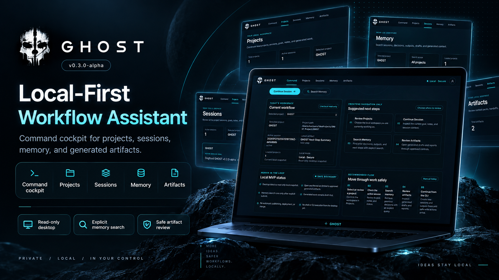

# GHOST

**GitHub, Handoff, Operations, Search, and Tracking**

<p align="center">
  
</p>

## Overview

GHOST is a local-first workflow assistant that combines a Python CLI workflow
engine with a companion macOS desktop cockpit. The CLI is the controlled write
path for creating projects, sessions, notes, outputs, context packs, handoffs,
and update packs. The desktop app provides safe review, search, and navigation
over approved local GHOST data without performing workflow writes.

GHOST stores workflow records locally and keeps generated material draft-first.
The desktop app does not execute the CLI, shell commands, AI calls, or release
operations.

## Release status

The current prerelease is **v0.3.0-alpha — Local MVP Desktop Checkpoint**. It is
an alpha build for local dogfooding and is not production-ready. The available
macOS DMG targets Apple Silicon (`aarch64`) only. The app and DMG are unsigned
and not notarized by Apple.

See the [v0.3.0-alpha release notes](docs/release-v0.3.0-alpha.md) for the exact
scope, known limitations, and verification details.

## Download and install GHOST desktop

1. Go to [GitHub Releases](https://github.com/kavisara-samarakoon/ghost/releases).
2. Download `GHOST_0.3.0-alpha_aarch64.dmg`.
3. In Terminal, verify the downloaded file:

   ```sh
   shasum -a 256 GHOST_0.3.0-alpha_aarch64.dmg
   ```

   Expected SHA256:

   ```text
   3ae94ed728819d0d5e1c96da6aa309365692624352a2e27f0227ae546083b783
   ```

4. Open the DMG and drag `GHOST.app` to `/Applications`.
5. On first open, macOS Gatekeeper may block the app because this alpha is
   unsigned and not notarized. Control-click or right-click `GHOST.app`, choose
   **Open**, then confirm **Open**.

## CLI setup from source

The CLI requires Python 3.11 or newer:

```sh
git clone https://github.com/kavisara-samarakoon/ghost.git
cd ghost/apps/cli
python3 -m venv .venv
./.venv/bin/python -m pip install --upgrade pip
./.venv/bin/python -m pip install -e ".[dev]"
./.venv/bin/ghost version
./.venv/bin/ghost doctor
./.venv/bin/ghost init
```

## Core CLI workflow quickstart

From `ghost/apps/cli`, replace the angle-bracketed values with your local
project details:

```sh
./.venv/bin/ghost project add <alias> --path "<project path>" --name "<Project Name>"
./.venv/bin/ghost project list
./.venv/bin/ghost session start <alias> --goal "<goal>"
./.venv/bin/ghost session note "<note text>" --project <alias>
./.venv/bin/ghost session status
./.venv/bin/ghost output add --type <codex|terminal> --project <alias> --file "<path>" --title "<title>"
./.venv/bin/ghost next <alias>
./.venv/bin/ghost context pack <alias>
./.venv/bin/ghost handoff <codex|chatgpt|gemini|antigravity> <alias>
./.venv/bin/ghost update-pack --project <alias>
```

Use the CLI to create or update workflow records, then open the desktop app to
review the resulting projects, sessions, memory, and artifacts. Return to the
CLI whenever a workflow write is needed. The desktop reads approved local GHOST
data but does not invoke the CLI or modify workflow records.

`GHOST_HOME` selects the global storage directory; without it, GHOST uses
`~/.ghost`. Each registered project gets its own `<project-root>/.ghost/`
workspace regardless of this override. Choose a temporary project directory if
you do not want a workspace in the repository. Project workspaces are not
automatically added to Git's ignore rules; review their contents before staging.

## Desktop page overview

- **Command:** Workflow cockpit showing the current project and workflow status.
- **Projects:** Review and select registered local workspaces.
- **Sessions:** Review active session goals, notes, and status.
- **Memory:** Search approved local GHOST memory locations after explicit submit.
- **Artifacts:** Review generated drafts and use safe **Open** or **Reveal** actions
  for approved artifacts.

## Command overview

| Command | Purpose |
| --- | --- |
| `ghost version` | Display the CLI package version without workflow storage access |
| `ghost init` | Initialize local global storage, preserving existing files |
| `ghost project add/list/show` | Register and inspect projects |
| `ghost session start/status/note/close` | Track goals, notes, and retained sessions |
| `ghost context pack <alias>` | Create an allowlisted project context draft |
| `ghost handoff codex/chatgpt/gemini/antigravity <alias>` | Prepare a provider-specific draft |
| `ghost output add/list` | Store sanitized supplied text or list output records |
| `ghost next <alias>` | Draft deterministic next steps |
| `ghost update-pack --project <alias>` | Prepare six review-only update drafts |
| `ghost doctor [--project <alias>]` | Check storage without modifying it |
| `ghost demo nexora` | Run a complete isolated sample workflow |

Slash-separated names are alternative subcommands. Use `ghost <command> --help`
for arguments and options.

## Session Manager — Milestone 2

With a registered project and the same `GHOST_HOME`:

```sh
ghost session start ghost --goal "Implement and validate the next milestone"
ghost session status ghost
ghost session status
ghost session note "Core behavior is tested; review the documentation." --project ghost
ghost session close ghost
```

Each project can have one active session. `status` without an alias shows all
active sessions and never writes to disk. `note` and `close` may omit the project
only when exactly one session is active globally. Closing retains the session
record and notes under `<project-root>/.ghost/sessions/<session-id>/`.

## Context and handoff drafts — Milestone 3

For a registered project:

```sh
ghost context pack ghost
ghost handoff codex ghost
ghost handoff chatgpt ghost
ghost handoff gemini ghost
ghost handoff antigravity ghost
```

Each command writes a timestamped Markdown draft under the project's
`.ghost/drafts/` and prints its path. Handoffs embed a fresh context snapshot;
no prior context pack is required. Only allowlisted workspace records and active
session notes are read—no source scan, Git inspection, AI call, upload, or command
execution. Recognizable credentials are redacted, but review drafts before sharing;
redaction cannot recognize every secret. Fill in the owner-approved scope manually.

## Output logging and next steps — Milestone 4

```sh
ghost output add --type codex --project ghost --file /path/to/result.txt \
  --title "Implementation report"
printf '%s\n' 'Manual validation completed.' | \
  ghost output add --type terminal --project ghost
ghost output list --project ghost --limit 10
ghost next ghost
```

Outputs are sanitized before storage under `.ghost/outputs/`, with an index that
links the active session when present. `--project` may be omitted from `output add`
only when exactly one session is active globally. `ghost next` requires an alias
and combines safe workspace context with recent indexed outputs in a local draft.
Neither command executes the supplied text, calls AI, or verifies claimed results.
Environment-file inputs are refused; review sanitized artifacts before sharing.

## Update packs — Milestone 5

```sh
ghost update-pack --project ghost
```

Creates six Markdown drafts under `.ghost/drafts/update-packs/<UTC-timestamp>-<suffix>/`:
`README-update.md`, `release-notes.md`, `linkedin-post.md`, `portfolio-update.md`,
`project-summary.md`, and `chatgpt-review-request.md`. Uses safe workspace context,
active notes, and the five newest indexed outputs; no prior context/next draft is
required. Recorded progress is unverified, and unknown claims stay as owner-review
placeholders. Review all drafts for accuracy and privacy before manually sharing.
Nothing is published, executed, committed, or pushed.

## Doctor + Release Readiness — Milestone 6

```sh
ghost doctor
ghost doctor --project ghost
```

Doctor reports PASS/WARN/ERROR findings for global storage and registered project
workspaces, including identity, session, and output-index consistency. `--project`
checks only the selected workspace and required global registry. Errors exit 1;
warnings alone exit 0. Nothing is created, repaired, or audited by doctor.

Run doctor before continued milestone work, then run the tests/lint below and
review the diff. Storage health does not verify test results or approve a release;
CI, review, and the [release workflow](docs/release-workflow.md) still apply.

## Real Project Integration Demo — Milestone 7

```sh
ghost demo nexora
```

No setup or real project path is needed. Each run creates a private
`ghost-demo-nexora-*` directory in the OS temporary location, containing a fresh
`ghost-home/` and fictional `nexora-demo/` project. It uses its own storage even if
`GHOST_HOME` is already set, and leaves that environment variable unchanged.

The demo registers the sample project, seeds status/decisions/milestones, starts
and annotates a session, stores sanitized fake Codex/Astra output, and generates
a context pack, four handoffs, a next-step draft, and six update drafts. It runs
doctor in-process and saves `DEMO-REPORT.md` with health findings, artifact paths,
and manual review steps. All project claims are marked DEMO / SAMPLE; nothing
demonstrates actual NEXORA implementation or validation.

Artifacts remain available for review until manually removed or cleaned by the
OS. Each invocation creates a separate run. Existing project paths are not
accepted. See [the demo walkthrough](docs/demo-workflow.md) for follow-up commands,
repeatability, and failure handling.

## Safety boundaries and limitations

- The desktop does not run shell commands or execute the GHOST CLI.
- The desktop does not call AI APIs or network services.
- The desktop does not publish, deploy, merge, or release automatically.
- Desktop workflow write actions are not implemented yet; the CLI remains the
  controlled write path.
- Desktop refresh may require reopening the app.
- Desktop search is limited to approved local GHOST memory locations and requires
  explicit submit.
- Safe **Open** and **Reveal** actions are limited to approved local artifacts.
- The current macOS app and DMG are unsigned and not notarized.
- Do not store secrets in GHOST notes or outputs. Free-form text is not a complete
  secret scanner, and workflow content remains plaintext in local storage.

The CLI only writes local GHOST context files. It does not read `.env` files,
call AI APIs, execute terminal commands, automate GitHub, or use cloud services.
Workflows are draft-first: creating a draft or workspace never approves an action.
Audit metadata redacts sensitive keys, including nested values. Session audit
events omit goal and note contents, but those contents remain plaintext in the
local workspace and session status displays goals.

## Development validation

From `apps/cli`, with the virtual environment active:

```sh
pytest
ruff check .
ghost --help
ghost version --help
ghost version
ghost project --help
ghost session --help
ghost context --help
ghost handoff --help
ghost output --help
ghost next --help
ghost update-pack --help
ghost doctor --help
ghost demo --help
```

Tests use temporary GHOST homes and project directories, never the real `~/.ghost`.
See [CLI documentation](apps/cli/README.md) for storage and recovery details and
[the sprint plan](docs/cli-sprint-plan.md) for the milestone boundaries.

## Release helpers — Milestone 2.5

Use the [release workflow](docs/release-workflow.md) for focused milestone branches,
approved-file commits, PR checks, and confirmed merge/tag operations. The helpers
live in `scripts/release` and are separate from the GHOST CLI. Automated merge/tag
refuses to proceed without successful CI checks.

## CI — Milestone 4.5

[GitHub Actions CI](.github/workflows/ci.yml) checks pull requests targeting `main`
and pushes to `main`: CLI tests/lint on Python 3.11 and 3.14, release-helper syntax
and safety tests, desktop frontend build/tests, native macOS Rust tests/checks,
and repository whitespace/cache/build-artifact hygiene. CI is validation
only; human review and the [release workflow](docs/release-workflow.md) confirmations
remain required before merge/tag.
